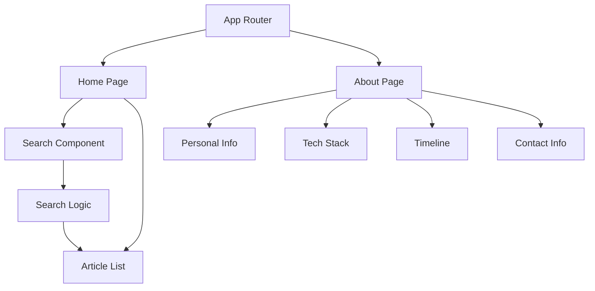
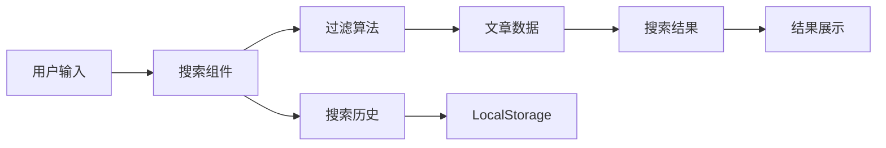

## 产品概述

实现博客系统的 About 页面和首页搜索功能，提升用户体验和内容发现效率。About 页面将展示博主的个人信息、技术栈和工作经历，首页搜索功能将支持按标题和标签进行实时内容过滤。

## 核心功能

- About 页面展示个人信息、技术栈、工作经历时间线和联系方式
- 首页搜索栏支持按文章标题和标签进行实时搜索
- 响应式设计适配不同设备
- 搜索结果高亮显示匹配内容
- 搜索历史记录和热门搜索推荐

## 技术栈

- **前端框架**: React + TypeScript
- **样式方案**: Tailwind CSS
- **路由管理**: React Router
- **状态管理**: React Hooks (useState, useEffect, useContext)
- **搜索实现**: 客户端实时过滤算法
- **数据持久化**: LocalStorage (搜索历史)

## 系统架构

### 整体架构

采用组件化的单页应用架构，基于 React 的函数式组件和 Hooks 进行状态管理。



### 模块划分

- **搜索模块**: 实现实时搜索过滤逻辑，包含搜索框组件、搜索算法和结果展示
- **About 页面模块**: 包含个人信息展示、技术栈卡片、工作经历时间线和联系方式组件
- **路由模块**: 管理页面导航和路由配置
- **共享组件模块**: 可复用的 UI 组件如卡片、按钮、图标等

### 数据流



## 实现细节

### 核心目录结构

```
src/
├── components/
│   ├── Search/
│   │   ├── SearchBar.tsx
│   │   ├── SearchResults.tsx
│   │   └── SearchHistory.tsx
│   ├── About/
│   │   ├── PersonalInfo.tsx
│   │   ├── TechStack.tsx
│   │   ├── Timeline.tsx
│   │   └── ContactInfo.tsx
│   └── shared/
│       ├── Card.tsx
│       └── Button.tsx
├── pages/
│   ├── Home.tsx
│   └── About.tsx
├── hooks/
│   ├── useSearch.ts
│   └── useLocalStorage.ts
├── utils/
│   └── searchUtils.ts
└── types/
    └── index.ts
```

### 关键代码结构

```typescript
// 搜索相关类型定义
interface SearchState {
  query: string;
  results: Article[];
  history: string[];
  isSearching: boolean;
}

// 搜索 Hook
const useSearch = () => {
  const [searchState, setSearchState] = useState<SearchState>();
  const performSearch = (query: string) => { };
  const saveSearchHistory = (query: string) => { };
  return { searchState, performSearch, saveSearchHistory };
};

// About 页面数据结构
interface PersonalData {
  name: string;
  title: string;
  bio: string;
  techStack: TechItem[];
  experience: TimelineItem[];
  contact: ContactInfo;
}
```

### 技术实现要点

1. **搜索算法**: 实现模糊匹配和权重排序，支持标题和标签的联合搜索
2. **实时搜索**: 使用防抖技术优化搜索性能，避免频繁触发
3. **搜索历史**: 利用 LocalStorage 持久化用户搜索记录
4. **响应式设计**: 使用 Tailwind CSS 实现移动端适配
5. **时间线组件**: 创建可复用的垂直时间线组件展示工作经历

### 性能优化

- 搜索防抖处理减少不必要的计算
- 虚拟滚动优化大量搜索结果的渲染
- 组件懒加载提升页面加载速度
- 搜索结果缓存避免重复计算

## 设计风格

采用现代简约风格，以清爽的视觉效果和流畅的交互体验为核心。About 页面使用卡片式布局展示信息层次，搜索功能采用渐进式交互设计，提供直观的搜索体验。

## About 页面设计

- **个人信息区域**: 头像、姓名、职位标题的居中展示，配合简洁的个人简介
- **技术栈展示**: 使用标签云或卡片网格展示技术能力，支持分类显示
- **工作经历时间线**: 垂直时间线设计，清晰展示职业发展历程
- **联系方式**: 社交媒体图标和联系方式的优雅展示

## 搜索功能设计

- **搜索框**: 带有搜索图标的输入框，支持占位符提示和清除按钮
- **实时建议**: 搜索时显示匹配建议和历史记录
- **结果展示**: 高亮匹配关键词，显示文章摘要和标签
- **空状态**: 无搜索结果时的友好提示和推荐内容

## 子代理

- **system-architect** (来自 <subagent>)
- 目的: 分析 MVP-4 的技术需求，创建详细的架构设计和实现计划
- 预期结果: 生成包含 About 页面和搜索功能的技术架构文档和分阶段实现计划

- **sprint-developer** (来自 <subagent>)
- 目的: 执行具体的代码实现任务，包括 About 页面组件和搜索功能开发
- 预期结果: 完成所有功能模块的代码实现，确保符合设计规范和技术要求

- **quality-auditor** (来自 <subagent>)
- 目的: 验证实现的功能是否满足需求，进行代码质量检查和功能测试
- 预期结果: 确保 About 页面和搜索功能正常工作，符合验收标准