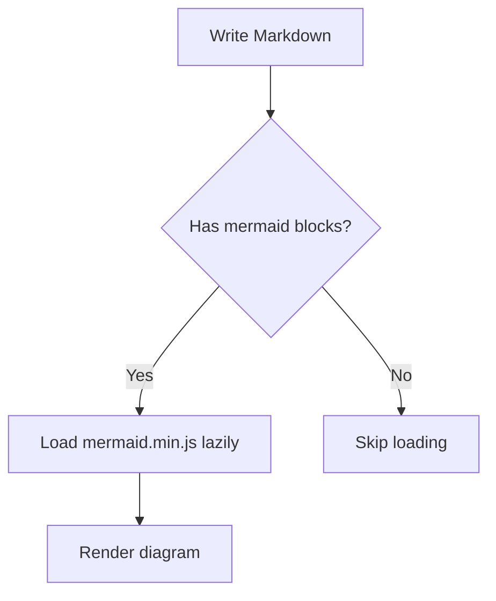
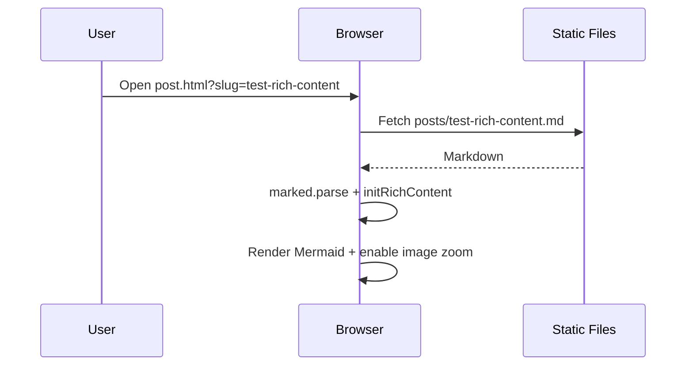

# Testing Rich Content

This post tests **Prism.js** code highlighting, **KaTeX** math rendering, **Mermaid** diagrams, and **image zoom**.

## Code Highlighting

Here is some Python code:

```python
def fib(n):
    a, b = 0, 1
    while a < n:
        print(a, end=' ')
        a, b = b, a+b
    print()

fib(1000)
```

And some JavaScript:

```javascript
const greet = (name) => {
  console.log(`Hello, ${name}!`);
};

greet("World");
```

## Math Formulas

Inline math looks like this: $E = mc^2$.

Block math should be centered:

$$
f(x) = \int_{-\infty}^\infty \hat f(\xi)\,e^{2\pi i \xi x} \,d\xi
$$

Matrices:

$$
\begin{pmatrix}
a & b \\
c & d
\end{pmatrix}
$$

## Mermaid Diagrams

A simple flowchart:



A sequence diagram:



## Images (Click to Zoom)

Click the image to zoom (powered by medium-zoom):


